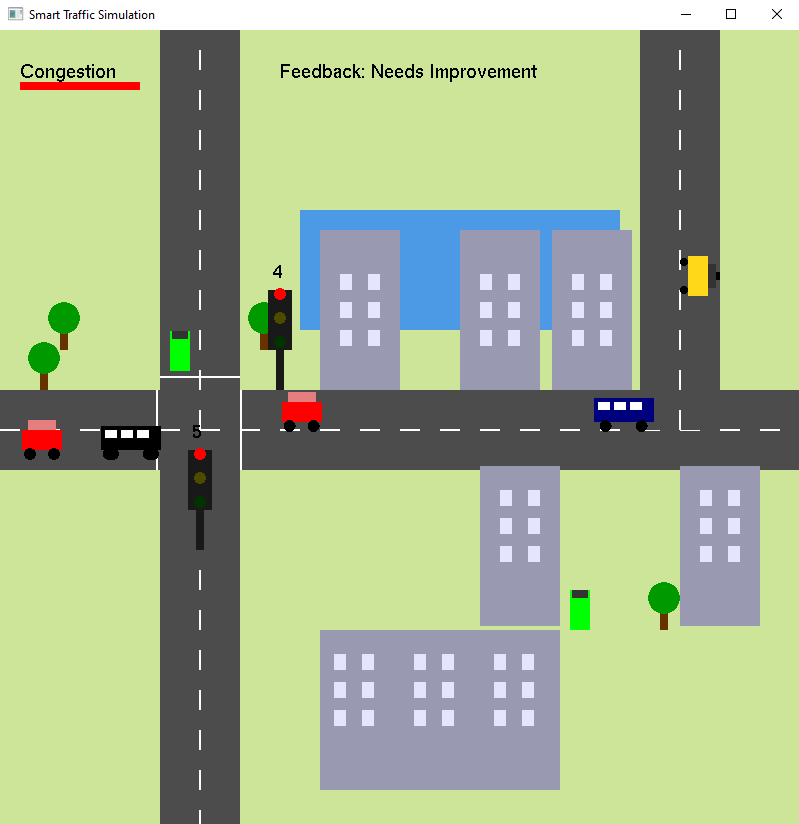

# 🚦 Smart Traffic Simulation for Urban Education and Planning

## 🏆 Project Overview
Traffic congestion is a growing issue, especially in developing countries like Bangladesh. This project is an **interactive, animated traffic simulation** built using **C++ and OpenGL**. It aims to educate primary-level students and urban planners about traffic signal coordination, congestion management, and smart city concepts.

Through **visual learning and interactive control**, users can experiment with different traffic scenarios to understand **efficient traffic flow and urban mobility**.

---

## 🎮 Controls (Key Mappings)

> You start from a main menu screen. Use the keys below to control the simulation.

### 🚥 Traffic Signal Control

- **Horizontal Road**:
  - `1`: Set GREEN light
  - `2`: Set YELLOW light
  - `3`: Set RED light

- **Vertical Road**:
  - `G`: Set GREEN light
  - `H`: Set YELLOW light
  - `J`: Set RED light

### 🌓 Environment

- `D`: Switch to **Day mode**
- `N`: Switch to **Night mode**

### 📋 Main Menu

- `S`: Start Simulation
- `E`: Exit the program

## 🚗 Features

- Multiple vehicle types: car, bus, taxi, bike
- Turning vehicles with animation
- Fully functional traffic light system
- Congestion level calculation with visual feedback
- Environment change: day and night modes
- Interactive menu and real-time updates
- Pedestrian-style stop lines, buildings, trees, and a pool for realism

---

## Screenshots




---

## 🛠 Requirements

- C++ compiler
- OpenGL & GLUT (FreeGLUT recommended)

### Example on Windows with MinGW:

```bash
g++ Main.cpp -lfreeglut -lopengl32 -lglu32 -o traffic_sim
./traffic_sim
```
## License
MIT
